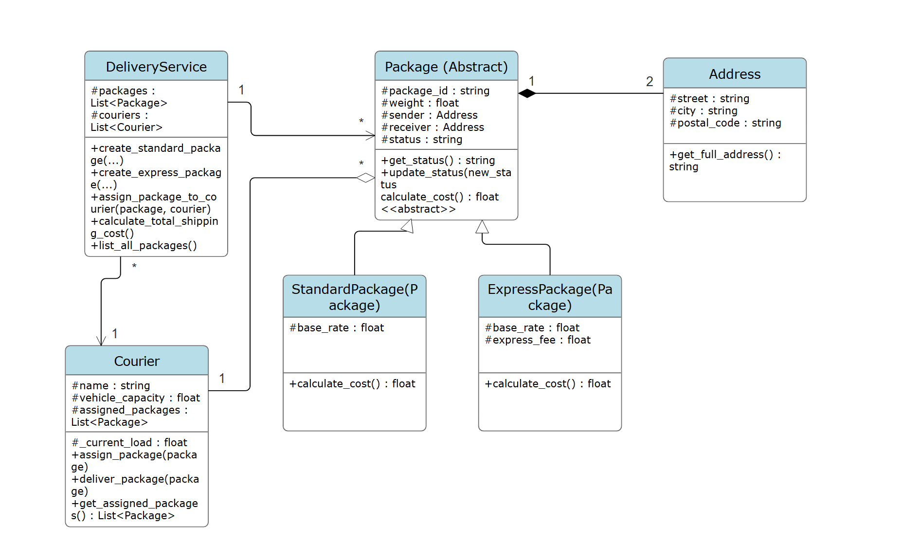

# Package Delivery System – Coursework Report

---

## 1. Introduction

### Goal of the coursework

The goal of this coursework is to design and implement an **object-oriented Package Delivery System** using Python.  
The program allows users to create, store, manage, and update delivery packages through a console interface.

The system demonstrates:

- Object-oriented programming (OOP)
- Abstract classes and inheritance
- Data validation and error handling
- File persistence (saving/loading data)

---

### What is the application?

The application is a **console-based logistics management system** that simulates package handling operations in a delivery company environment.

Users can:

- Create Standard or Express packages
- Enter sender and receiver addresses
- View all stored packages
- Update delivery status
- Save and load data from file

---

### How to run the program

1. Open the project folder
2. Make sure all Python files are in the same directory
3. Run the main program:

```bash
python main.py
```

### How to use the program

After running, a menu appears:

1. Create package
2. Show packages
3. Update status
4. Save and exit

### User workflow

- Create packages by entering required data  
- View saved packages  
- Update package delivery status  
- Save and exit the system

All inputs are validated to prevent crashes.

---

## 2. Body / Analysis

This section explains how the system is designed and how it meets the coursework requirements.

The application is built using **object-oriented programming (OOP)** principles in Python. The system is structured into multiple classes that work together to simulate a package delivery system.

---

## UML Class Overview



The system consists of the following main classes:

- Package (abstract class)
- StandardPackage
- ExpressPackage
- Address
- PackageFactory
- DataManager

These classes work together to create, manage, and store delivery packages.

---

## 2. Body / Analysis

This section explains the design and implementation of the Package Delivery System and how it satisfies the required functional and object-oriented programming principles.

The system is built using **object-oriented programming (OOP)** and is structured into multiple interacting classes. Each class is responsible for a specific part of the system, which ensures modularity, readability, and maintainability.

---

### 2.1 Overall System Design

The application follows a layered class structure where different responsibilities are separated:

- Core domain classes (Package, Address)
- Specialized package types (StandardPackage, ExpressPackage)
- System logic (DeliveryService / DataManager / PackageFactory)

This separation allows the system to simulate real-world logistics behavior in a simplified but structured way.

The UML diagram illustrates the relationships between these classes.

---

### 2.2 Abstraction

Abstraction is used to define a general structure for all packages without exposing implementation details.

The `Package` class acts as an abstract base class that defines shared attributes and methods for all package types.

---

#### Example:

```python
from abc import ABC, abstractmethod

class Package(ABC):
    def __init__(self, package_id, weight, sender, receiver):
        self._package_id = package_id
        self._weight = weight
        self._sender = sender
        self._receiver = receiver
        self._status = "Created"

    @abstractmethod
    def calculate_cost(self):
        pass
```

---

### Explanation:

- The `Package` class is marked as abstract using `ABC`
- It cannot be instantiated directly
- It defines common attributes (`package_id`, `weight`, `sender`, `receiver`) shared by all packages
- The method `calculate_cost()` is declared but not implemented
- This forces all subclasses to provide their own implementation
- It ensures a consistent structure across all package types

---

### 2.3 Inheritance

Inheritance is another key object-oriented programming principle used in this system. It allows new classes to reuse existing code from a parent class while also extending or modifying its behavior.

In this project, inheritance is implemented by creating specific package types (`StandardPackage`, `ExpressPackage`) that inherit from the base `Package` class.

---

### Example:

```python
class StandardPackage(Package):
class ExpressPackage(Package):
```

---

### Explanation:

- The `StandardPackage` and `ExpressPackage` classes inherit from the `Package` base class  
- They reuse shared attributes such as `package_id`, `weight`, `sender` and `receiver`

---

### 2.4 Polymorphism

Polymorphism is an object-oriented programming principle that allows different classes to be treated through a common interface while each class can behave differently based on its implementation.

In this system, polymorphism is mainly demonstrated through the `calculate_cost()` method, which is shared across different package types but produces different results depending on the object.

---

### Example:

```python
class StandardPackage(Package):
    def calculate_cost(self):
        return round(self._base_rate * self._weight, 2)


class ExpressPackage(Package):
    def calculate_cost(self):
        return round(self._base_rate * self._weight + self._express_fee, 2)
```

---

### Explanation:

- The same method call `calculate_cost()` is used for different package objects  
- The `StandardPackage` and `ExpressPackage` classes provide their own implementations of this method  
- The correct version of the method is chosen at runtime depending on the object type  
- This allows one function to work with multiple types of packages  
- The system does not need to know the exact class of the object in advance

---

### 2.5 Composition

Composition is an object-oriented programming principle where one class is made up of one or more objects from other classes. It represents a strong “has-a” relationship, meaning that a class contains other objects as part of its structure.

In this system, composition is used to build a `Package` using `Address` objects for both sender and receiver information.

---

### Example:

```python
class Address:
    def __init__(self, street, city, postal_code):
        self._street = street
        self._city = city
        self._postal_code = postal_code
        
class Package:
    def __init__(self, sender_address, receiver_address):
        self.sender_address = Address(sender_address)
        self.receiver_address = Address(receiver_address)
